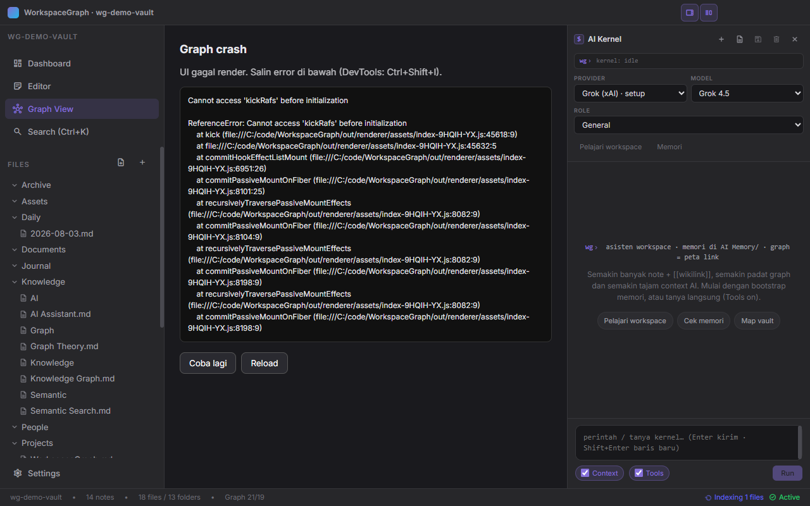
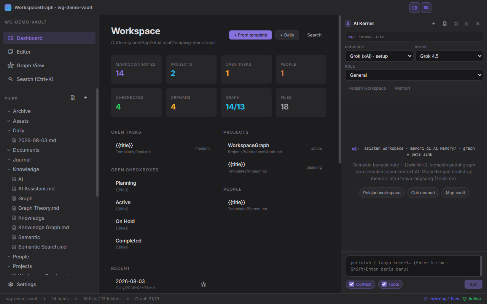
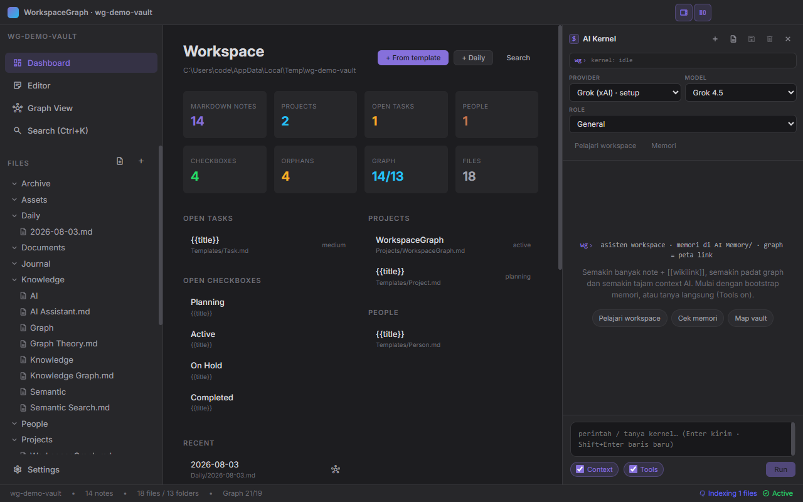
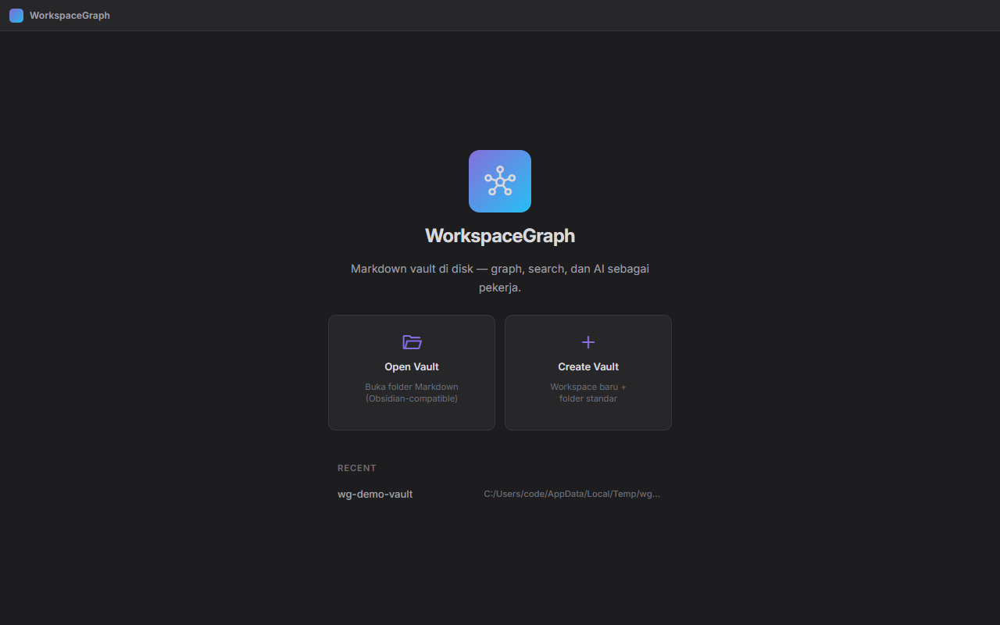

<div align="center">


# WorkspaceGraph

**A local-first knowledge graph & AI workspace — built like Obsidian, powered by semantic RAG.**


[Download](#installation) · [Features](#features) · [Screenshots](#screenshots) · [AI Setup](#ai-setup) · [Development](#development)

</div>

---

## What is this?

WorkspaceGraph is an **Electron desktop application** that turns a folder of Markdown files into a living knowledge graph. Think Obsidian — but with a built-in AI assistant that uses your own notes as context through a full Retrieval-Augmented Generation (RAG) pipeline, entirely on your machine.

> 🔒 **Your data never leaves your computer.** The AI reads your vault, not the cloud. API keys are encrypted locally with `safeStorage` and never exposed to the renderer.

---

## Screenshots

| Graph View | Editor (live preview) |
|---|---|
|  |  |

| Dashboard | Welcome |
|---|---|
|  |  |

---

## Features

### 📝 Markdown-native editor
- Live preview with split source/rendered modes
- Frontmatter support (YAML)
- WikiLink `[[Note Title]]` creation & navigation

### 🕸️ Knowledge Graph
- Interactive force-directed graph of your notes
- WikiLink edges + tag edges
- Local graph (neighbors of a single note)
- Ghost nodes for unresolved links
- Filter by type, tag, degree, orphan, hub

### 🤖 AI Assistant (Multi-provider)
- Chat with your vault — AI gets relevant context automatically
- Supports: **Gemini, Claude, OpenAI, Ollama (local), OpenRouter, Grok**
- Agent roles: General, Writer, Researcher, Curator, Planner
- Tool use: AI can read and propose edits to your notes (approve/reject UI)

### 🔍 Hybrid Search (FTS + Semantic)
- SQLite FTS5 full-text search (keyword)
- **Local vector embeddings** via `all-MiniLM-L6-v2` (semantic similarity)
  - Runs 100% offline after first model download (~25MB)
  - Vectors persisted to SQLite — no re-indexing on restart
  - Status badge shows indexing progress in real time

### 🔗 WikiLink Auto-Update
- Renaming a file automatically updates `[[links]]` across the entire vault
- Toast notification shows how many links were updated

### 🧠 AI Memory (Self-Feeding RAG)
- AI maintains its own index/sop/log notes in `AI Memory/`
- Memory grows over time, making the AI smarter about your specific vault

### 🧩 Templates, Tasks & Domains
- Built-in templates: project, task, people, daily, SOP, and more
- Domain overview with checkbox tracking
- Automations & declarative plugins

---

## Installation

### 📦 From GitHub Releases (recommended)

Grab the installer for your OS from the [Releases page](https://github.com/ngodingsendiri/WorkspaceGraph/releases):

| OS | File | Notes |
|----|------|-------|
| **Windows** | `WorkspaceGraph-<version>-setup.exe` | NSIS installer, x64 |
| **macOS** | `WorkspaceGraph-<version>.dmg` | Drag to Applications |
| **Linux** | `WorkspaceGraph-<version>.AppImage` | `chmod +x` then run |

> Installers are produced automatically from CI when a version tag is pushed (`v*.*.*`). No installer for your platform yet? [Build from source](#build-from-source) — it takes ~2 minutes.

### 🔨 Build from source

#### Prerequisites
- [Node.js](https://nodejs.org/) v20+ (CI uses 22)
- [Git](https://git-scm.com/)

```bash
git clone https://github.com/ngodingsendiri/WorkspaceGraph.git
cd WorkspaceGraph
npm install
npm run dev          # development mode with HMR
npm run build        # production build (out/)
npm run build:win    # Windows installer (dist/)
npm run build:mac    # macOS dmg
npm run build:linux  # Linux AppImage
```

---

## AI Setup

Go to **Settings → AI Providers** and configure at least one provider:

| Provider | What you need |
|----------|--------------|
| **Gemini** | Google AI API key from [ai.google.dev](https://ai.google.dev) |
| **Claude** | Anthropic API key from [console.anthropic.com](https://console.anthropic.com) |
| **OpenAI** | OpenAI API key from [platform.openai.com](https://platform.openai.com) |
| **Ollama** | [Ollama](https://ollama.com) running locally (free, fully offline) |
| **OpenRouter** | OpenRouter API key — access 100+ models |
| **Grok** | xAI API key or import from the local CLI (`auth.json`) |

### Recommended free setup
1. Install [Ollama](https://ollama.com) → `ollama pull llama3.2`
2. In WorkspaceGraph: Settings → AI Providers → Ollama → Save
3. The semantic embedding model downloads automatically on first vault open

---

## How the RAG pipeline works

```
User query
    │
    ├─► Active note (highest priority)
    ├─► WikiLink neighbors (graph traversal)
    ├─► Backlinks
    ├─► AI Memory notes (long-term workspace knowledge)
    ├─► Semantic search (vector similarity — all-MiniLM-L6-v2)
    └─► FTS keyword search (SQLite FTS5)
            │
            ▼
    Context package → AI provider → Streaming response
```

---

## Vault Structure

WorkspaceGraph works with **any folder of Markdown files**. There are no required folders.

Optionally, create these for best AI experience:
```
Your Vault/
├── AI Memory/          ← AI writes here; RAG reads here first
│   ├── 00 Index.md
│   ├── 01 SOP.md
│   └── 02 Log.md
├── .workspacegraph/    ← auto-created (config + SQLite DB)
│   ├── workspace.json
│   └── index.db
└── ... your notes ...
```

---

## Development

```bash
npm run dev          # Electron dev server with HMR
npm run typecheck    # TypeScript check (node + web)
npm test             # Vitest unit tests (1000+ tests)
npm run lint         # ESLint
npm run build        # Production build
```

### Architecture

| Layer | Technology |
|-------|-----------|
| App shell | Electron (main process) |
| UI | React + Zustand + Vite |
| Graph engine | Custom WikiLink parser + force-layout |
| Search | SQLite FTS5 + Fuse.js |
| Semantic RAG | `@xenova/transformers` (ONNX / WebAssembly) |
| AI providers | Gemini / Claude / OpenAI / Ollama / OpenRouter / Grok |
| File watching | chokidar |

### Quality gates (CI)

Every push runs: **typecheck → lint → 1000+ vitest tests (with coverage) → production build**. All checks must pass on `main` before a release is cut.

---

## License

[MIT](LICENSE) — do whatever you want, attribution appreciated.
